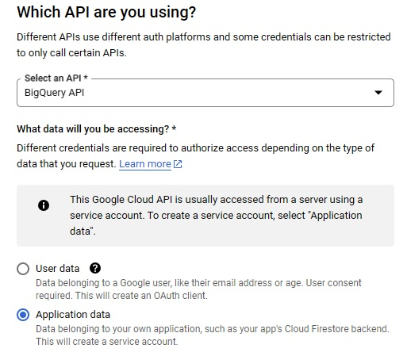
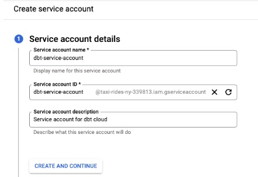
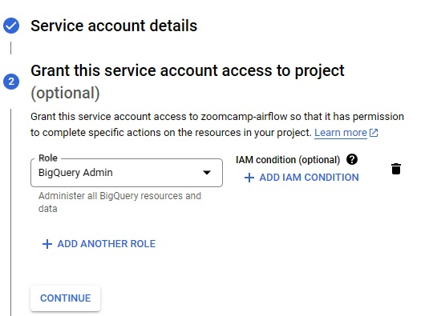
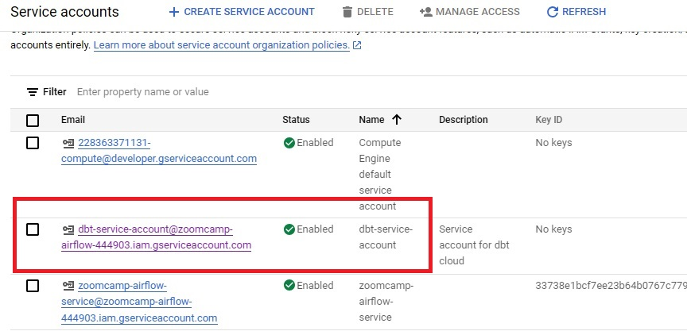
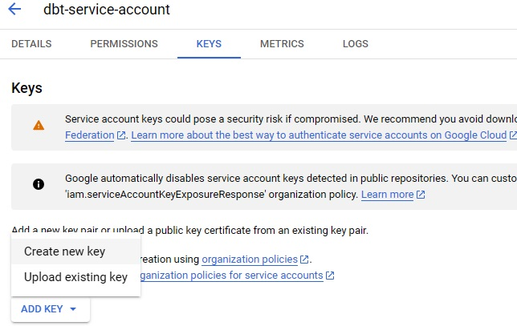

# Create a BigQuery service account

In order to connect we need the service account JSON file generated from bigquery. Open the [BigQuery credential wizard](https://console.cloud.google.com/apis/credentials/wizard) to create a service account. Select BigQuery API and Application data

Next --> Continue --> Complete Service account name and description

Click on Create and continue

Select role --> BigQuery Admin

You can either grant the specific roles the account will need or simply use BigQuery admin, as you'll be the sole user of both accounts and data.

  
Click on continue --> Click on Done

### Download JSON key

Now that the service account has been created we need to add and download a JSON key, go to the keys section, select "create new key". Select key type JSON and once you click on create it will get inmediately downloaded for you to use.

In the navigation menu (the three horizontal lines in the top-left corner), go to IAM & Admin > Service Accounts.

Find the dbt service account:

Navigate to the Keys tab. Click on Add Key > Create New Key

select JSON as the key type --> Create. A Json file will be downloaded, keep it in a safe place.
