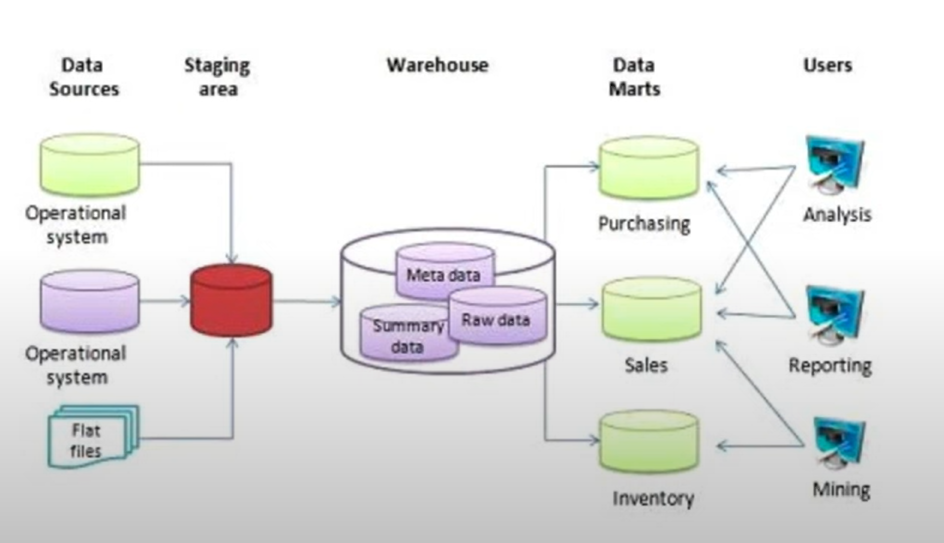
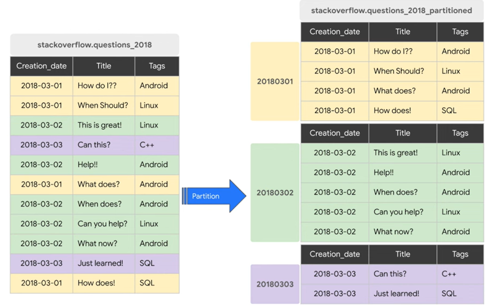
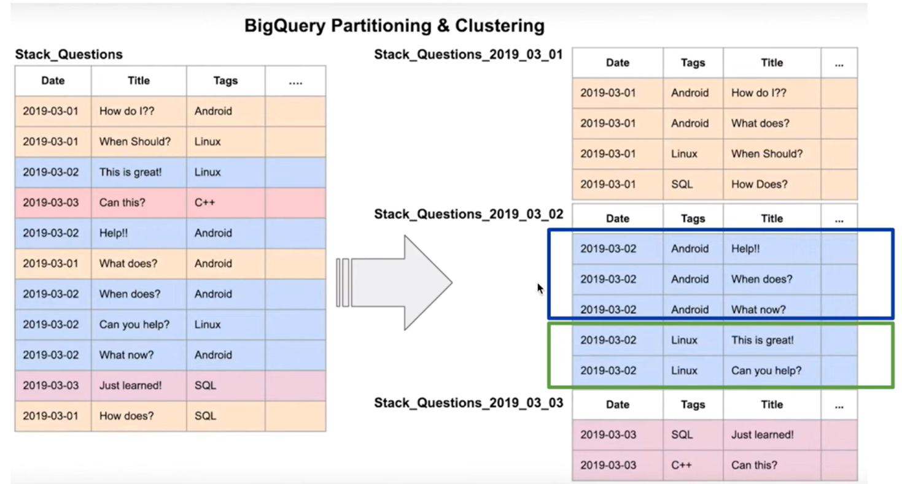
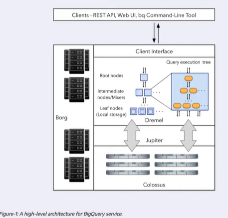
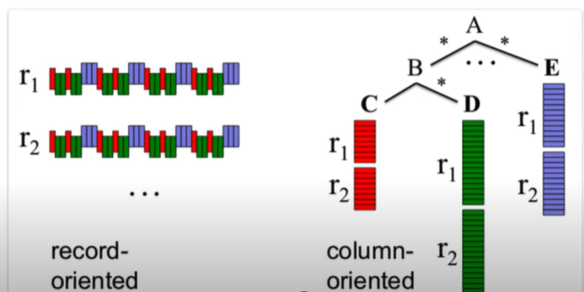

# Module 3: Data warehouse

Index:

- OLAP vs OLTP
- What is a data warehouse
- BigQuery
  - Cost
  - Partitions and Clustering
  - Best Practices
- Internals
- ML in BQ

## OLAP vs OLTP

OLTP: Online Transaction Processing
OLAP: Online analytical processing

|  | OLTP | OLAP |
|----------|----------|----------|
| Purpose  | Control and run essential business operations in real time   | Plan, solve problems, support decisions, discover hidden insights   |
| Data Updates   | Short, fast updates iniciated by user   | Data periodically resfreshsed with scheduled, long-running batch jobs   |
| Database design    | Normalized databases for efficiency   | Denornalized databses for analysis   |
| Space requirements    | Generally small if historical data is archived   | Generally large due to aggregating large datasets  |
| Backup and recovery    |  Regular backups required to ensure business contrinuity and meet legal and governance requirements  | Lost data can be reloaded from OLTP databases as needed in lieu or regular backups  |
| Productivity    |  Increases productivity of end users  | Increases productivity of business managers, data analysts, and executives  |
| Data view    |  Lists day-to-day business transactions  | Multi-dimensional view of enterprise data  |
| User examples   | Customer-facing personnel, clerks, online shoppers  | Knowledge workers such as data analyst, business analyst, and executives |

## What is a Data warehouse (DWH)

{: width="400"}

### Big Query

- **Serverless DWH**: There are no servers to manage or database software to install
- Software as well as infrastructure including scalability (from few GB to PB easily) and high-availability
- Built-in feature like ML, geospatial analysis, Business Intelligence
- Maximizes flexibility by separating the compute engine that analyzes your data from your storage

Considerations:

- BigQuery generally cashses data. Within a query > More > Cache.
- Provides Open Source public data. E.g. bigquery-public-data > citibike_stations

#### Big query costs

- On demand pricing: based on demand you scan or processes. For every 1TB of data processed is around 5$.
- Flat rate pricing:
  - Based on number of pre requested slots
  - 100 slots -> 2000$/month = 400 TB data processed on demand pricing.

BigQuery gives an aproximate estimation of data to be processed when run a query at the top right of the SQL editor.
The real estimatioon after execution is given in the results area.

#### External tables

BigQuery allows to create external table from different sources

```bash
CREATE OR REPLACE EXTERNAL TABLE `taxi-rides-ny.nytaxi.yellow_external_yellow_tripdata`
OPTIONS (
  format = 'CSV',
  uris = ['gs://nyc-tl-data/trip data/yellow_tripdata_2019-*.csv','gs://nyc-tl-data/trip data/yellow_tripdata_2020-*.csv']
);
```

```bash
CREATE OR REPLACE EXTERNAL TABLE `zoomcamp.ny_taxi_yellow_tripdata`
OPTIONS (
  format = 'PARQUET',
  uris = ['gs://my-zoomcamp-project-12978-kestra/yellow_tripdata_2024-*.parquet']
);
```

When creating the table BigQuery cannot know how the size will be or the cost as the data is out of BigQuery, usually in GCP.
You can query it but the data is not actually in BigQuery.

When you create a table (not external) the data will actually go to BigQuery storage:

```bash
-- Create a non partitionated table from external table
CREATE OR REPLACE TABLE taxi-rides-ny.nytaxi.yellow_tripdata_non_partitioned AS
select * from taxi-rides-ny.nytaxi.external_yellow_tripdata
```

In this case table size and number of rows will be known by BigQuery.

#### Partitions and clusterse

Assuming data will be queried depending on a field, typically a date for example, partition improves efficiency.

**Partition**:

{: width="600"}

**Clustering**:

{: width="600"}

In BigQuery you can choose:

- Time unit column
- Ingestion time (_PARTITIONTIME)
- When using time unir or ingestion time: Daily (Default), hourly, monthly, yearly.
- Integer range partitioning
- Number of partition limit is 4000
- Columns you specify are used to colocate related data
- Order of the column is important
- The order of the specified columns determines the sort order of the data
- Clustering improves
  - filter queries
  - aggregate queries
- Table with data size < 1GB do not show significant improvement with partitioning and clustering
- You can specify up to four clustering columns
- Clustering columns must be top-level, non-repeated columns: DATE, BOOL, GEOGRAPHY, INT64

Once BQ understand that only data for specific value of that partition is required it will not process or read data related to non-interested values of that partitioned field.

Let's say we partition by date and we ask for a specific date, BQ will ignore data from other dates.

| Clustering | Partitioning |
|----------|----------|
| Cost benefit unknown | Cost known upfront  (You can set rules like if the cost of this query exceeds X$ amount, do not execute) |
| You need more granularity than partitioning alone allows |You need partition-level management|
| Your queries commonly use filters or aggregation against multiple particular columns | Filter or aggregate on single column |
| The cardinality of the number of values in a column or group of columns is large | |

##### Clustering over partitioning

- Partitioning results in a small amount of data per partition (aproximately lass than 1 GB)
- Partitioning results in a large number of partitions beyond the limits of partitionined tables
- Partitioning results in  your mutation operations modifying the majority of partitions in the table frequency (e.g. every few minutes)

When you are writing to BigQuery tables with high frequency data that modifies partitions, that might not be a good idea.

##### Automatic reclusteirng

As data is added to a clustered table:

- The newly inserted data can be written to blocks that contain key ranges that overlap with the key range sin preivous written blocks.
- These overlapping keys weaken the sort property of the tbale

To maintain the performance characteristics of a clustered table:

- BigQuery performs automatic re-clustering in the background to restore the sort proprety of the table.
- For partitioned tables, clustering is maintenaed for data within the scope of each partition.

#### Examples

```bash
-- Create partitioned table from texternal table
CREATE OR REPLACE TABLE taxi-rides-ny.nytaxi.yellow_tripdata_non_partitioned AS
PARTITION BY
    DATE(tpep_pickup_datetime) AS
select * from taxi-rides-ny.nytaxi.external_yellow_tripdata
```

Icon in the tables within a BigQuery dataset will be different.
It is possible to check how many rows are within each partition with:

```bash
SELECT table_name, partition_id, total_rows
FROM `nytaxi.INFORMATION_SCHEMA.PARTITIONS`
WHERE table_name = 'yellow_tripdata_partitoned'
ORDER BY total_rows DESC;
```

```bash
CREATE OR REPLACE TABLE taxi-rides-ny.nytaxi.yellow_tripdata_partitoned_clustered
PARTITION BY DATE(tpep_pickup_datetime)
CLUSTER BY VendorID AS
SELECT * FROM taxi-rides-ny.nytaxi.external_yellow_tripdata;
```

## Best practices in BigQuery

- **Cost reduction**
  - Avoid SELECT *: Specify the columns you want to access to.
  - Price your queries before running them: Price can bee seen on the top right corner.
  - Use clustered or partitioned tables
  - Use streaming inserts with caution
  - Materialize query results in stages

- **Query performance**
  - Filter on partitioned (or clustered) columns
  - Denormalizing data
  - Use nested or repeated columns
  - Use external data sources approprietaly
  - Don't use it, in case u want a higher query performance
  - Reduce data before using a Join
  - Do not treat WITH clauses as prepared statements
  - Avoid oversharding tables
  - Avoid JavaScript user-defined functions
  - Use approximate aggregatin functions (HyperLogLog++)
  - Order last, for query operations to maximize performance
  - Opetimize your join patterns
  - As a best practice, place the table with the largest number of rows first, followed bu the table with the fewest rows, and then place the reamining tables by decreasing size

## Internals of BigQuery

BigQuery stores data into a separate storage called Colossus. Colossus is a cheap storage, it stores data in columnar format.
The most cost comes from processing or querying the data (compute).
This means compute and storage are on different Hardware.
They need to communicate. It uses Jupyter network, this netwrok is inside BQ datacentes and it provides 1TB/S capabilities.
Dremel: Query execution engine. It divides the query into a tree structure and separate your query so each node can execute a subset of the query.

record-oriented data: easy to process and to understand
columnar-oriented data: helps with aggregations

BQ Architecture:

{: width="600"}

Column vs record data:

{: width="600"}

## Links

- [BigQuery](https://cloud.google.com/bigquery/docs/introduction)
- [Dremel](https://research.google/pubs/dremel-interactive-analysis-of-web-scale-datasets-2/)
- [BigQuery Architecture by Panoply](https://panoply.io/data-warehouse-guide/bigquery-architecture/)
- [BigQuery Architecture Presentation](https://docs.google.com/presentation/d/1a3ZoBAXFk8-EhUsd7rAZd-5p_HpltkzSeujjRGB2TAI/edit#slide=id.p)
