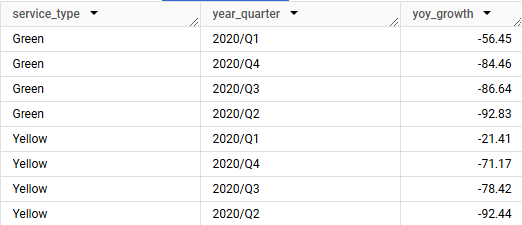
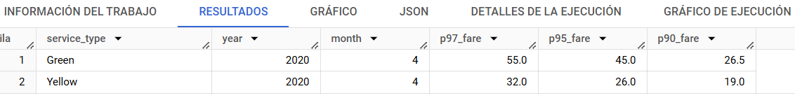

# Solution Homework 3

## Cohort 2025

### Question 1

The compile model will of:

```sql
select * 
from {{ source('raw_nyc_tripdata', 'ext_green_taxi' ) }}
```

The correct answer is:

- [x] select * from myproject.raw_nyc_tripdata.ext_green_taxi

We are using raw_nyc_tripdate as the name of the source.
The ENV variables are:

```shell
export DBT_BIGQUERY_PROJECT=myproject
export DBT_BIGQUERY_DATASET=my_nyc_tripdata
```

but in the sources.yml file we have:

```yaml
- name: raw_nyc_tripdata
    database: "{{ env_var('DBT_BIGQUERY_PROJECT', 'dtc_zoomcamp_2025') }}"
    schema:   "{{ env_var('DBT_BIGQUERY_SOURCE_DATASET', 'raw_nyc_tripdata') }}"
```

In the schema they are not the same variables!

### Question 2

Solution:

- [x] `where pickup_datetime >= CURRENT_DATE - INTERVAL '{{ var("days_back", env_var("DAYS_BACK", "30")) }}' DAY`

With this filter we can control the date range of the data processed:

Without `DAYS_BACK` variable set and run with `dbt run -m fact_recent_trips` will use the default value of 30 days.

With `DAYS_BACK` variable set to 7 and run with `dbt run -m fact_recent_trips` will use the value of 7 days.

For specific values we can use the `--vars` parameter:

Run with `dbt run -m fact_recent_trips --vars '{"days_back": 15}'` will use the value of 15 days.

This exercise was solved by creating the model fact_recent_trips.sql and compiling it with the different values (Used compile instead of run to avoid executing the model).

### Question 3

This question aims to check if the students have understood the concept of materialized and not materialized data sources.

A **non-materialized data source** refers to raw data or upstream models that have not yet been built into tables or views in the database. When a model depends on non-materialized data sources, dbt must first process and build those upstream dependencies before it can execute the dependent model.

Models depending on raw data sources (`raw_nyc_tlc_record_data.ext_*`) cannot be executed directly because these sources are not yet materialized. For example, `stg_fhv_tripdata` depends on `raw_nyc_tlc_record_data.ext_fhv`¡, which is non-materialized. Therefore, dbt must first process this raw data before executing any downstream models.

If you attempt to run a downstream model (e.g., `fct_taxi_monthly_zone_revenue`) without building its non-materialized dependencies:

- The execution will fail because dbt cannot find the required intermediate tables or views in the database.

- To avoid this, you need to ensure that all upstream dependencies (e.g., staging models) are built first.

Therefore, the correct answer is:

- [x] dbt run --select models/staging/+

### Question 4

- [x] Setting a value for  `DBT_BIGQUERY_TARGET_DATASET` env var is mandatory, or it'll fail to compile
- [ ] Setting a value for `DBT_BIGQUERY_STAGING_DATASET` env var is mandatory, or it'll fail to compile
- [x] When using `core`, it materializes in the dataset defined in `DBT_BIGQUERY_TARGET_DATASET`
- [x] When using `stg`, it materializes in the dataset defined in `DBT_BIGQUERY_STAGING_DATASET`, or defaults to `DBT_BIGQUERY_TARGET_DATASET`
- [x] When using `staging`, it materializes in the dataset defined in `DBT_BIGQUERY_STAGING_DATASET`, or defaults to `DBT_BIGQUERY_TARGET_DATASET`

Summary:

- `DBT_BIGQUERY_TARGET_DATASET` is required.
- `DBT_BIGQUERY_STAGING_DATASET` is optional (falls back to `DBT_BIGQUERY_TARGET_DATASET`).
- Core models always go to `DBT_BIGQUERY_TARGET_DATASET`.
- Staging models go to `DBT_BIGQUERY_STAGING_DATASET`, or fallback to `DBT_BIGQUERY_TARGET_DATASET` if missing.

### Question 5

Model: [fct_taxi_trips_quarterly_revenue.sql](../taxi_rides_ny/models/core/fct_taxi_trips_quarterly_revenue.sql)

Query:

```sql
select 
    service_type,
    year_quarter,
    yoy_growth
from `angular-rhythm-450212-n4.zoomcamp_dbt_core_prod.fct_taxi_trips_quarterly_revenue`
where year = 2020
order by service_type, yoy_growth desc
```



- [ ] green: {best: 2020/Q2, worst: 2020/Q1}, yellow: {best: 2020/Q2, worst: 2020/Q1}
- [ ] green: {best: 2020/Q2, worst: 2020/Q1}, yellow: {best: 2020/Q3, worst: 2020/Q4}
- [ ] green: {best: 2020/Q1, worst: 2020/Q2}, yellow: {best: 2020/Q2, worst: 2020/Q1}
- [x] green: {best: 2020/Q1, worst: 2020/Q2}, yellow: {best: 2020/Q1, worst: 2020/Q2}
- [ ] green: {best: 2020/Q1, worst: 2020/Q2}, yellow: {best: 2020/Q3, worst: 2020/Q4}

### Question 6

Model: [fct_taxi_trips_monthly_fare_p95.sql](../taxi_rides_ny/models/core/fct_taxi_trips_monthly_fare_p95.sql)

Query:

```sql
select
*
from `angular-rhythm-450212-n4.zoomcamp_dbt_core_prod.fct_taxi_trips_monthly_fare_p95`
where year = 2020 and month = 4
order by service_type, year, month
```



- [ ] green: {p97: 55.0, p95: 45.0, p90: 26.5}, yellow: {p97: 52.0, p95: 37.0, p90: 25.5}
- [x] green: {p97: 55.0, p95: 45.0, p90: 26.5}, yellow: {p97: 31.5, p95: 25.5, p90: 19.0}
- [ ] green: {p97: 40.0, p95: 33.0, p90: 24.5}, yellow: {p97: 52.0, p95: 37.0, p90: 25.5}
- [ ] green: {p97: 40.0, p95: 33.0, p90: 24.5}, yellow: {p97: 31.5, p95: 25.5, p90: 19.0}
- [ ] green: {p97: 55.0, p95: 45.0, p90: 26.5}, yellow: {p97: 52.0, p95: 25.5, p90: 19.0}

### Question 7


