# Analytics Engineering

Disclaimer: Notes forked from section 4 README [2025 Notes by Manuel Guerra](https://github.com/ManuelGuerra1987/data-engineering-zoomcamp-notes/blob/main/4_Analytics-Engineering/README.md)

## Table of contents

- [Analytics Engineering](#analytics-engineering)
  - [Table of contents](#table-of-contents)
  - [DBT and BigQuery](#dbt-and-bigquery)
    - [Set up Environment](#set-up-environment)
    - [Copy taxi\_rides\_ny folder](#copy-taxi_rides_ny-folder)
    - [Create a dbt project (Alternative A - dbt Cloud)](#create-a-dbt-project-alternative-a---dbt-cloud)
    - [Add a Connection in DBT Cloud](#add-a-connection-in-dbt-cloud)
    - [Set up a GitHub Repository](#set-up-a-github-repository)
  - [Start Developing in DBT Cloud](#start-developing-in-dbt-cloud)
    - [Create new branch](#create-new-branch)
    - [Development of dbt Models](#development-of-dbt-models)
      - [Modular data modelling](#modular-data-modelling)
    - [Developing the first staging model](#developing-the-first-staging-model)
      - [schema.yml](#schemayml)
      - [model stg\_green\_tripdata](#model-stg_green_tripdata)
        - [Step by step explanation of the model](#step-by-step-explanation-of-the-model)
    - [Developing the second staging model](#developing-the-second-staging-model)
    - [Core Models](#core-models)
      - [Dim zones](#dim-zones)
      - [Fact trips](#fact-trips)
      - [Data marts dm\_monthly\_zone\_revenue](#data-marts-dm_monthly_zone_revenue)
  - [Building the project](#building-the-project)
    - [schema.yml values](#schemayml-values)
    - [Run dbt build](#run-dbt-build)
    - [Check BigQuery](#check-bigquery)
    - [Run dbt project in production](#run-dbt-project-in-production)
    - [Continuous Integration](#continuous-integration)
      - [Setting Up CI in dbt Cloud](#setting-up-ci-in-dbt-cloud)
      - [Example Workflow](#example-workflow)
      - [Alternatively CI with Github Actions](#alternatively-ci-with-github-actions)

## DBT and BigQuery

Bigquery project structure:

- `zoomcamp`: BigQuery Dataset where Kestra will create the tables from CSV.
- `zoomcamp_dbt`: It is a simplificaton of zoomcamp keeping just the main tables: `green_tripdata`, `yellow_tripdata`, `fhv_tripdata`. Manually copy the tables from zoomcamp to this dataset.
- `zoomcamp_dbt_core`: It is the development dataset where we will create models in development from **dbt Core**.
- `zoomcamp_dbt_core_prod`: It is the production dataset where we will create the models from **dbt Core**.
- `zoomcamp_dbt_core_ci`: It is the development dataset that the CI process will use to run the tests from **dbt Core**.
- `zoomcamp_dbt_dev`: It is the development dataset where we will create the models in development from **dbt Cloud**.
- `zoomcamp_dbt_prod`: It is the production dataset where we will create the models from **dbt Cloud**.

### Set up Environment

- Created dedicated DBT service account in GCP with BigQuery Admin [Check notes in 02-workflow-orchestration](notes_gcp_setup.md)
- Created developed account in DBT Cloutd
- Created project in DBT Cloud (following file `dbt_cloud_setup.md`):
  - By default it appeard "IFCO" as an account not sure why (cannot change the name)
  - Within that account I use the default project "Analytics"
  - Added in Account > Connections the connection to BigQuery by adding a specific created json credentials service account in the GCP project. Set location default to `europe-west2` as it is the location of the BigQuery dataset.
  - I created and added new brand repository in GitHub [zoomcamp2025-dbt-project]([zoomcamp2025-dbt-project](https://github.com/AlvaroPica/zoomcamp2025-dbt-project).
  - Added a DBT deploy key in GitHub Repo deploy keys
  - Created Credentials > Development with a specific dataset target in Bigquery: `zoomcamp_dbt`

  
### Copy taxi_rides_ny folder

Copy taxi_rides_ny folder from `https://github.com/DataTalksClub/data-engineering-zoomcamp/tree/main/04-analytics-engineering` in your 04-analytics-engineering folder.

This is the final DBT Project already completed. This taxi_rides_ny folder contains macros, models, seeds. Cloning these elements gives you a strong foundation for your DBT project, enabling you to focus on building and improving your data pipeline rather than starting from scratch. Also saves time by reducing the need to recreate common logic or datasets.

```bash
git clone https://github.com/DataTalksClub/data-engineering-zoomcamp.git
```

Then copy the `taxi_rides_ny` folder in your own `04-analytics-engineering` folder

### Create a dbt project (Alternative A - dbt Cloud)

Create a dbt cloud account from [their website](https://www.getdbt.com/pricing/) (free for solo developers). Once you have logged in into dbt cloud you will be prompt to create a new project.

You are going to need:

- Access to your data warehouse (bigquery)
- Admin access to your repo, where you will have the dbt project.

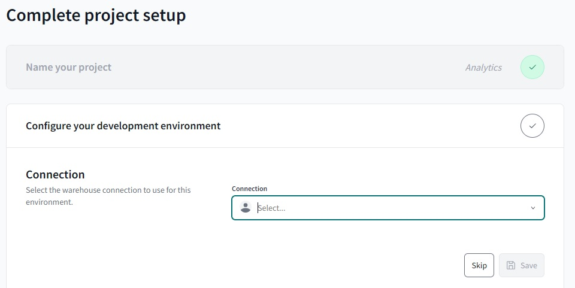

### Add a Connection in DBT Cloud

At **account** level:

- Connections --> Add new connection --> Select BigQuery
- Click on Upload a Service Account JSON file --> upload the json downloaded from the BigQuery Service Account you created previously.

At **project** level:

- Back on your project setup, select BigQuery
- Test the connection
- In Account > Credentials > Project > Development credentials make sure you have your dataset name set (e.g. `zoomcamp_dbt`)

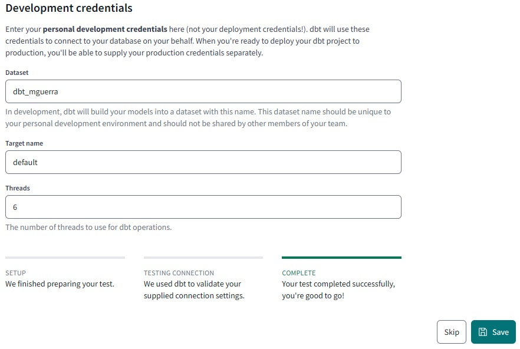

### Set up a GitHub Repository

The repository that dbt Cloud will manage can be a dedicated one or the general you use for this project. If it is general you will need to specify the project subdirectory in which DBT will be executed.

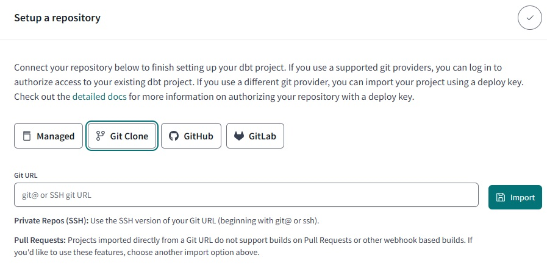

Connect the repository:

- Select git clone, paste the SSH link from your repo and click on import:
  - Go again inside the Repository information and copy the deploy key.
  - Head to your GitHub repo and go to the settings tab.
  - In Deploy keys click on add key and paste the deploy key provided by dbt cloud (Make sure to click on "write access")
- If you have dbt Cloud properly linked in GitHub (You should see DBT App from GitHub) it is better to select the botton GitHub instead of SSH.
  
## Start Developing in DBT Cloud

Back on dbt cloud, click on next, you should look this:

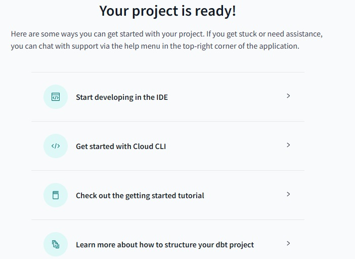

Also make sure you informed taxi_rides_ny as the project subdirectory (as it is not a dedicated repo for the DBT project):

On the left sidebar, click on dashboard --> settings --> Edit

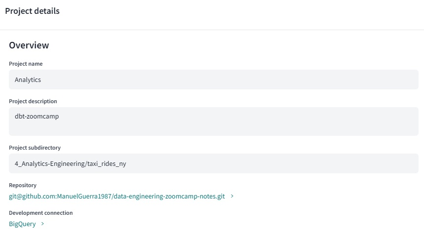

### Create new branch

On the left sidebar, click on Develop --> Cloud IDE

Create a new branch:

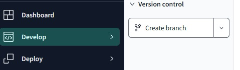

I will use "dbt" branch. After creating the new branch, you can go to your repo on github and see the new branch created.

Note: it is important to create a new branch, because if we had chosen to work on the master branch we would get stuck in read-only mode.

### Development of dbt Models

_[Video source](https://www.youtube.com/watch?v=ueVy2N54lyc)_

Let's start now with the development of those DBT models. If we go back to the initial lessons, DBT sits on top of our platform, either BigQuery or Postgres.

We already loaded the raw data as the trips data. Now we're going to work on development, testing, and documentation. We'll start with development and by the end of these lessons, we'll deploy this into production to use those transformations in our BI tools.

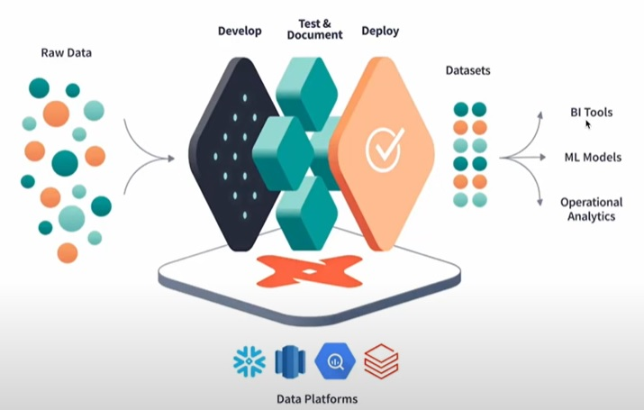{: width="50%"}

#### Modular data modelling

To get started, we're going to use a modular data modeling approach. As we discussed in earlier lessons, we'll create fact tables and dimensional tables. The structure of our DBT project will look something like this:

- First, we have the tables we loaded (trips data). These are our sources.

- Then, we'll start building SQL scripts called "models" in DBT to perform transformations.

For example, we'll pick up the source data, clean it, deduplicate it, recast and rename columns, and typecast data. Afterward, we'll apply business logic to create fact and dimension tables. Finally, we'll create data marts to aggregate the data for our stakeholders.

We initially have tables that already exist outside our DBT project. These contain the data we will use, and we define them as sources. Additionally, we will use a file (e.g., taxi_zone_lookup) to create a table that will be incorporated into our transformations.

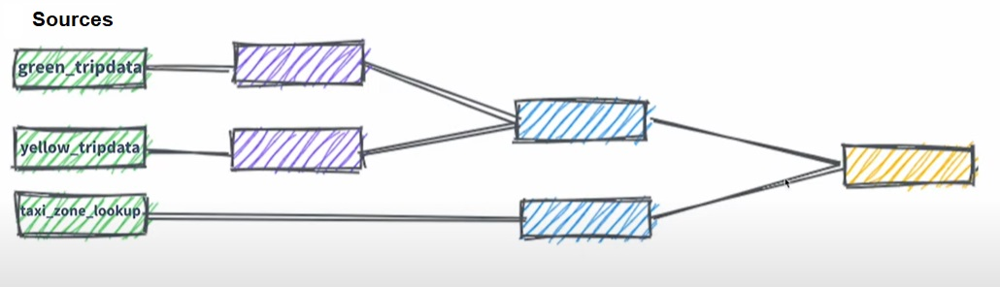

### Developing the first staging model

#### schema.yml

Under the models directory, there is a folder named staging. This will represent the initial layer of models responsible for cleaning the source data. Inside the staging folder, there is a schema.yml file for defining the sources:

```yaml

version: 2

sources:
  - name: staging
    database: zoomcamp-airflow-444903 
    schema: zoomcamp
      
    tables:
      - name: green_tripdata
      - name: yellow_tripdata

models:
    - name: stg_green_tripdata
    ...  
    - name: stg_yellow_tripdata
    ...
```

> [!NOTE]  
> Make sure the values ​​in the YAML match the values ​​in your BigQuery!

In this file, we'll define the **sources** and we'll define the database and schema where the data resides. Next, we'll define the **tables** we want to use, such as `green_tripdata` and `yellow_tripdata`. Once defined, these sources can be referenced in our models. For example, we'll start by working with the `green_tripdata`.

One advantage of using DBT's approach is that it adheres to the DRY (Don't Repeat Yourself) principle. If we change the schema or table name in the YAML file, all dependent models will automatically update without requiring code changes in multiple places.

#### model stg_green_tripdata

Inside the staging folder, there is a `stg_green_tripdata.sql` file. This dbt model defines a SQL query that transforms and materializes data from a source table (`green_tripdata`) into a view in the database.

`stg_green_tripdata.sql` looks like this:

```sql

{{
    config(
        materialized='view'
    )
}}

with tripdata as 
(
  select *,
    row_number() over(partition by vendorid, lpep_pickup_datetime) as rn
  from {{ source('staging','green_tripdata') }}
  where vendorid is not null 
)
select
    -- identifiers
    {{ dbt_utils.generate_surrogate_key(['vendorid', 'lpep_pickup_datetime']) }} as tripid,
    {{ dbt.safe_cast("vendorid", api.Column.translate_type("integer")) }} as vendorid,
    {{ dbt.safe_cast("ratecodeid", api.Column.translate_type("integer")) }} as ratecodeid,
    {{ dbt.safe_cast("pulocationid", api.Column.translate_type("integer")) }} as pickup_locationid,
    {{ dbt.safe_cast("dolocationid", api.Column.translate_type("integer")) }} as dropoff_locationid,
    
    -- timestamps
    cast(lpep_pickup_datetime as timestamp) as pickup_datetime,
    cast(lpep_dropoff_datetime as timestamp) as dropoff_datetime,
    
    -- trip info
    store_and_fwd_flag,
    {{ dbt.safe_cast("passenger_count", api.Column.translate_type("integer")) }} as passenger_count,
    cast(trip_distance as numeric) as trip_distance,
    {{ dbt.safe_cast("trip_type", api.Column.translate_type("integer")) }} as trip_type,

    -- payment info
    cast(fare_amount as numeric) as fare_amount,
    cast(extra as numeric) as extra,
    cast(mta_tax as numeric) as mta_tax,
    cast(tip_amount as numeric) as tip_amount,
    cast(tolls_amount as numeric) as tolls_amount,
    cast(ehail_fee as numeric) as ehail_fee,
    cast(improvement_surcharge as numeric) as improvement_surcharge,
    cast(total_amount as numeric) as total_amount,
    coalesce({{ dbt.safe_cast("payment_type", api.Column.translate_type("integer")) }},0) as payment_type,
    {{ get_payment_type_description("payment_type") }} as payment_type_description
from tripdata
where rn = 1


-- dbt build --select <model_name> --vars '{'is_test_run': 'false'}'


  limit 100


```

##### Step by step explanation of the model

```sql
{{
    config(
        materialized='view'
    )
}}
```

This sets the model to be materialized as a view. A view is a virtual table created dynamically by running the query each time it is accessed, rather than persisting data as a physical table.

```sql

with tripdata as 
(
  select *,
    row_number() over(partition by vendorid, lpep_pickup_datetime) as rn
  from {{ source('staging','green_tripdata') }}
  where vendorid is not null 
)

```

- **Data Source**: Fetches data from the `green_tripdata` table in the staging schema using the {{ source() }} function, which references an external table defined in dbt's sources.

- **Filtering**: Excludes rows where vendorid is NULL.

- **Deduplication**: Uses the row_number() function to assign a unique row number (rn) within each group of records partitioned by vendorid and lpep_pickup_datetime. This helps to remove duplicates later.

The main SELECT statement transforms the cleaned data (tripdata) into a more structured and enriched dataset:

```sql
{{ dbt_utils.generate_surrogate_key(['vendorid', 'lpep_pickup_datetime']) }} as tripid,
{{ dbt.safe_cast("vendorid", api.Column.translate_type("integer")) }} as vendorid,

```

- Generates a unique surrogate key (tripid) by combining vendorid and lpep_pickup_datetime using dbt's `generate_surrogate_key` utility.

- Safely casts `vendorid` to an integer using dbt's `safe_cast()` function. This will ensure it will work and compile properly independently of the database (Postgres, BigQuery, etc.)

```sql
cast(lpep_pickup_datetime as timestamp) as pickup_datetime,
cast(lpep_dropoff_datetime as timestamp) as dropoff_datetime,
```

- Converts datetime fields (`lpep_pickup_datetime`, `lpep_dropoff_datetime`) to timestamp format for consistent handling.

```sql
{{ dbt.safe_cast("passenger_count", api.Column.translate_type("integer")) }} as passenger_count,
cast(trip_distance as numeric) as trip_distance,
```

- Casts fields like `passenger_count` and `trip_distance` to appropriate types (integer and numeric).

```sql

cast(fare_amount as numeric) as fare_amount,
coalesce({{ dbt.safe_cast("payment_type", api.Column.translate_type("integer")) }},0) as payment_type,
{{ get_payment_type_description("payment_type") }} as payment_type_description

```

- Handles financial data like `fare_amount` and `tip_amount`, casting them to numeric

- Uses `coalesce()` to ensure `payment_type` is never NULL, defaulting to 0

- Maps `payment_type` to a human-readable description using a custom function (get_payment_type_description). It makes uses of **Macros**.

```sql
from tripdata
where rn = 1

```

- **Deduplication**: Ensures only the first record for each `vendorid` and `lpep_pickup_datetime` combination is included by filtering for rows where `rn = 1`.

```sql



  limit 100


```

A conditional execution checks if a variable `is_test_run` is True. If it’s True, it adds LIMIT 100 to the query. If it’s False, the query proceeds without the limit. The code also defines a default value for `is_test_run`, which is True. This means that unless specified otherwise, LIMIT 100 will always be added by default.

To test this, you can run the code as it is and confirm that the LIMIT 100 is applied. If you don’t want the limit, you can override the variable during execution by passing a dictionary of variables. For example:

```bash
dbt run --vars '{"is_test_run": false}'
```

When this command is executed, the code no longer adds the LIMIT 100. This is a useful technique for development, as it allows you to test with smaller datasets (faster and cheaper queries) while ensuring full production data is used during deployment by setting is_test_run to False.

This method, often referred to as a **dev limit**, is highly recommended for optimizing development workflows. By default, you’ll have faster and cheaper queries during development, but the limit can easily be removed when working with the full production data.

### Developing the second staging model

The next task is to create the staging file for yellow_trip_data. This is very similar to the previous file, so we won't go into detail about its structure. The code is almost identical, using the same macro.

### Core Models

So far, our project looks like this: we have our two sources and a set of models. Now, we need to create our fact and dimensional tables

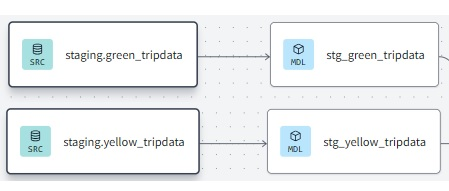

#### Dim zones

The goal for `dim_zones` is to act as a master data table containing all the zone information where the taxis operate. These taxis move within specific zones, and we want to ensure we have accurate information about them.

Since we don’t have source data for this, we’ll use the seeds mentioned earlier. For this, we'll leverage the `taxi_zone_lookup` file. It’s unlikely that this data will change frequently.

We’ll copy this data, save it as a CSV file, and include it in our project under the seeds folder. The file is named `taxi_zone_lookup.csv`, and it can be downloaded directly from GitHub if needed. Once saved, the seed file will have a distinct icon in the project, and we can preview the data.

The seed contains fields like `location_id`, which is also present in both the green and yellow trip data. This will allow us to connect the data with the `taxi_zone_lookup` table for additional context. The `dim_zones` model is under the core folder.

`dim_zones.dql` looks like this:

```sql

{{ config(materialized='table') }}

select 
    locationid, 
    borough, 
    zone, 
    replace(service_zone,'Boro','Green') as service_zone 
from {{ ref('taxi_zone_lookup') }}
```

The `dim_zones` model will use data from `taxi_zone_lookup`. It will define fields like `location`, `borough`, and `service_zone`. Additionally, we’ll address an issue where all entries labeled as "Borough" were actually "Green Zones" which only green taxis operate in. We'll clean up the data by renaming those values for easier analytics.

So far, our project looks like this:

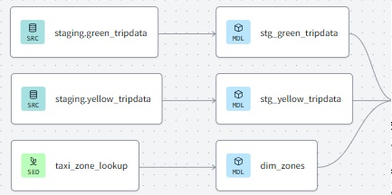

#### Fact trips

With `dim_zones`, we are ready to create the next step: a fact table for trips (`fact_trips`). We will combine the green and yellow trip data, encase it with dimensional data, and materialize it as a table. Materializing it as a table ensures better performance for analytics since this table will be large due to unions and joins.

`fact_trips.sql` model goal is to:

- Combine both green and yellow trip data.
- Add a field to identify whether a record is from the green or yellow dataset for easier analysis.
- Join this data with the dim_zones model to enrich it with pickup and drop-off zone details.

`fact_trips.sql` looks like:

```sql

{{
    config(
        materialized='table'
    )
}}

with green_tripdata as (
    select *, 
        'Green' as service_type
    from {{ ref('stg_green_tripdata') }}
), 
yellow_tripdata as (
    select *, 
        'Yellow' as service_type
    from {{ ref('stg_yellow_tripdata') }}
), 
trips_unioned as (
    select * from green_tripdata
    union all 
    select * from yellow_tripdata
), 
dim_zones as (
    select * from {{ ref('dim_zones') }}
    where borough != 'Unknown'
)
select trips_unioned.tripid, 
    trips_unioned.vendorid, 
    trips_unioned.service_type,
    trips_unioned.ratecodeid, 
    trips_unioned.pickup_locationid, 
    pickup_zone.borough as pickup_borough, 
    pickup_zone.zone as pickup_zone, 
    trips_unioned.dropoff_locationid,
    dropoff_zone.borough as dropoff_borough, 
    dropoff_zone.zone as dropoff_zone,  
    trips_unioned.pickup_datetime, 
    trips_unioned.dropoff_datetime, 
    trips_unioned.store_and_fwd_flag, 
    trips_unioned.passenger_count, 
    trips_unioned.trip_distance, 
    trips_unioned.trip_type, 
    trips_unioned.fare_amount, 
    trips_unioned.extra, 
    trips_unioned.mta_tax, 
    trips_unioned.tip_amount, 
    trips_unioned.tolls_amount, 
    trips_unioned.ehail_fee, 
    trips_unioned.improvement_surcharge, 
    trips_unioned.total_amount, 
    trips_unioned.payment_type, 
    trips_unioned.payment_type_description
from trips_unioned
inner join dim_zones as pickup_zone
on trips_unioned.pickup_locationid = pickup_zone.locationid
inner join dim_zones as dropoff_zone
on trips_unioned.dropoff_locationid = dropoff_zone.locationid
```

- Select all fields from both the green and yellow trip data using `ref()` for references and add a `service_type` column to distinguish the datasets.

- Union the data to create a combined dataset (`trips_union`).

- Join `trips_union` with `dim_zones` for both pickup and drop-off zones to associate zone names and other details. Only valid zones will be included (e.g., exclude unknown zones).

When we run the model with the full production dataset, the resulting table will contain millions of rows, representing a comprehensive and enriched fact table. This table is now ready for use in analysis or as a source for BI tools.

With all of this, the `fact_trips` table is complete, and we can proceed to testing and further analysis.

So far, our project looks like this:

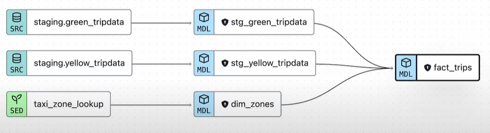

We can check the lineage to see how the modular data modeling looks. Now, we can observe that `fact_trips` depends
on all the required models. One of the great features of dbt is that it identifies all these connections. This
means we can run `fact_trips`, but first, dbt will execute all its parent models. dbt will test the sources for freshness or other requirements, run any missing or outdated models, and only then build `fact_trips`.

The final step is to test these models to ensure that all rows and calculations—totaling 62.7 million—are correct before delivering the results.

#### Data marts dm_monthly_zone_revenue

This is a dbt model that creates a table summarizing revenue-related metrics for trips data as a table selecting data from our previous dbt model called `fact_trips`. This model creates a table with monthly revenue metrics per pickup zone and service type, including various fare components, trip counts, and averages. It enables analysis of revenue trends, passenger patterns, and trip details across zones and services, giving a clear breakdown of monthly performance.

`dm_monthly_zone_revenue.sql` looks like:

```sql

{{ config(materialized='table') }}

with trips_data as (
    select * from {{ ref('fact_trips') }}
)
    select 
    -- Reveneue grouping 
    pickup_zone as revenue_zone,
    {{ dbt.date_trunc("month", "pickup_datetime") }} as revenue_month, 

    service_type, 

    -- Revenue calculation 
    sum(fare_amount) as revenue_monthly_fare,
    sum(extra) as revenue_monthly_extra,
    sum(mta_tax) as revenue_monthly_mta_tax,
    sum(tip_amount) as revenue_monthly_tip_amount,
    sum(tolls_amount) as revenue_monthly_tolls_amount,
    sum(ehail_fee) as revenue_monthly_ehail_fee,
    sum(improvement_surcharge) as revenue_monthly_improvement_surcharge,
    sum(total_amount) as revenue_monthly_total_amount,

    -- Additional calculations
    count(tripid) as total_monthly_trips,
    avg(passenger_count) as avg_monthly_passenger_count,
    avg(trip_distance) as avg_monthly_trip_distance

    from trips_data
    group by 1,2,3
```

The main query groups the data by:

- Pickup zone (pickup_zone) → Labeled as revenue_zone.
- Month of the pickup date (pickup_datetime) → Labeled as revenue_month.
- Service type (service_type) → Such as economy, premium, etc.

For each group, the query calculates revenue-related metrics like `revenue_monthly_fare` (Sum of fare_amount), `revenue_monthly_extra` (Sum of additional fees), etc and other metrics like `total_monthly_trips` (Count of trips), `avg_monthly_passenger_count` (Average number of passengers per trip) and `avg_monthly_trip_distance` (Average distance per trip).

Finally, The `GROUP BY 1, 2, 3` clause organizes the results by the specified dimensions (pickup zone, revenue month, and service type). Each calculation is applied within these groups. 1 refers to `pickup_zone`, 2 refers to the truncated month of `pickup_datetime`, 3 refers to `service_type`.

So far, our project looks like this:

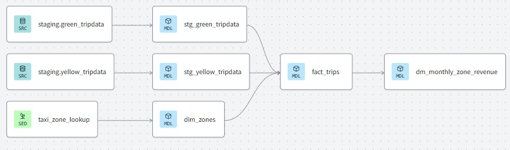

## Building the project

### schema.yml values

On DBT Cloud or in VSCode, go to `taxi_rides_ny` --> `models` --> `staging` --> `schema.yml`

Make sure that project id, dataset name and tables matches your project id, dataset and tables name in BigQuery!

```yaml

sources:
  - name: staging
    database: zoomcamp-airflow-444903 # project id
    schema: zoomcamp # dataset name with the source tables
     
    tables:
      - name: green_tripdata #table name
      - name: yellow_tripdata #table name
```

Values check:

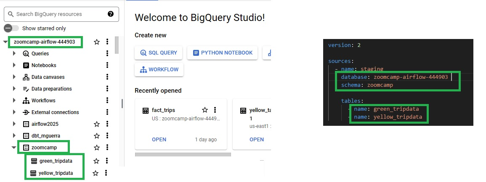

### Run dbt build

In the dbt cloud console, run:

```bash
dbt build
```

You should look something like this:
  
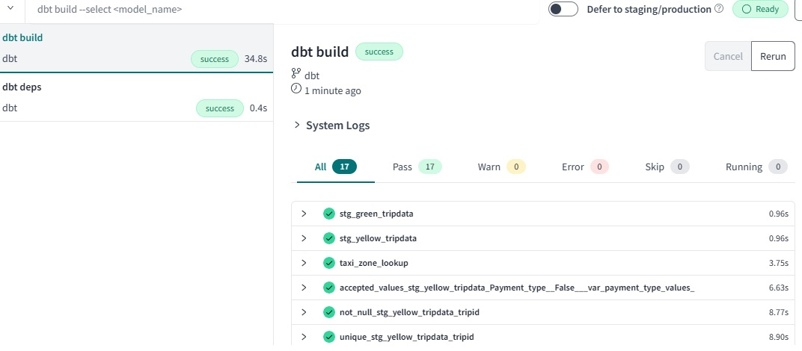

After running the model (`dbt build`), the process should complete successfully, creating a view. You can check the view details to confirm the output, including the `trip_id` and other data fields. You can also examine the compiled SQL in the target/compiled folder for additional troubleshooting.

When you run `dbt build` in dbt Cloud, it does the following:

- **Builds Models**: Executes the SQL transformations defined in your project to create or update tables and views in your target data warehouse.

- **Runs Tests**: Validates data quality by executing both custom tests (defined in .yml files) and standard tests (like unique or not null constraints).

- **Updates Snapshots**: Captures historical changes in your source data for versioning and time-based analytics.

- **Loads Seeds**: Loads any seed files (like .csv files) defined in your project into the target data warehouse.

By default, only 100 rows are processed in the query for testing purposes. This is controlled by the `is_test_run` variable, which defaults to true in `stg_green_tripdata.sql` and `stg_yellow_tripdata` models. To run the query without this limit and process the full dataset in production, you need to explicitly set the variable to false by using the following command:

```bash
dbt build --select +fact_trips.sql+ --vars '{is_test_run: false}'
```

### Check BigQuery

Head over to BigQuery and check the views that dbt generated:

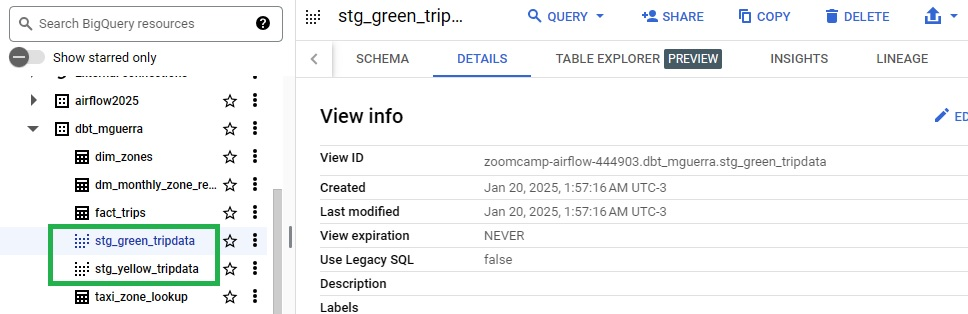

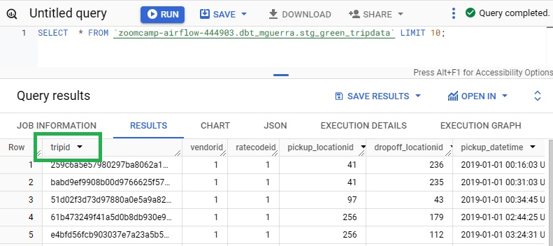

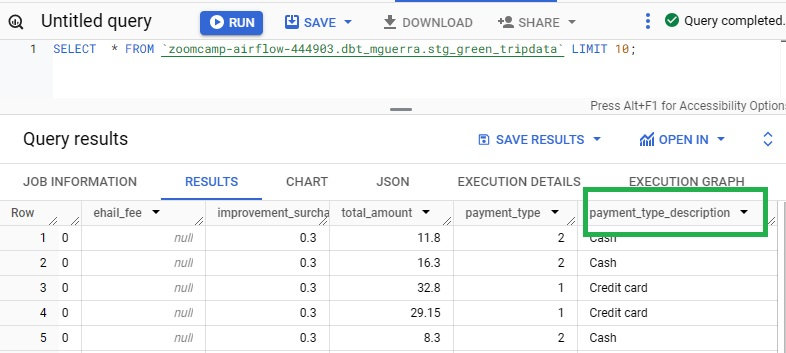

Dim_zones:

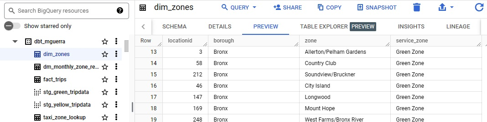

Fact_trips:

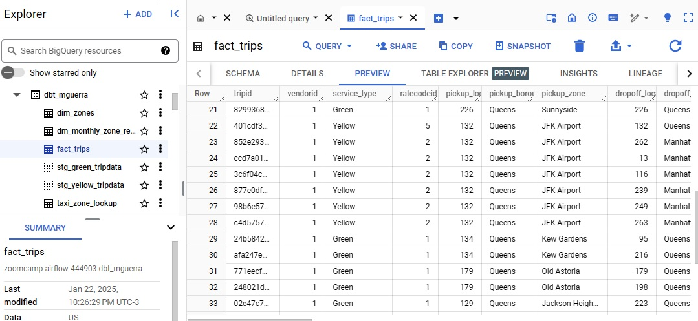

dm_monthly_zone_revenue:

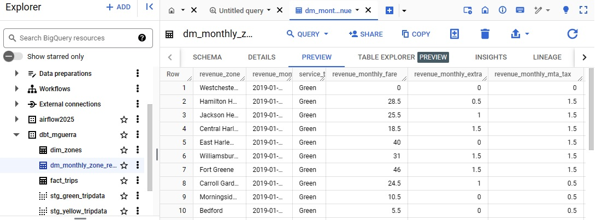

### Run dbt project in production

We are now going run projects in production.

- First, under the environment settings, we create a new deployment environment called "production." This environment is labeled as a deployment and categorized under "prod." Once saved, we're ready to create our first job.

- Second, we create a new job. We’ll create a deployment job that runs, for example, nightly. This is where the data transitions to the production environment. By default, it includes a `dbt build` step, but this can be customized. Within the deployment process, we can create dbt jobs that run multiple commands. A single job can execute multiple steps, such as `dbt build`, `dbt test`, `dbt seed`, or `dbt source freshness`. These runs can be triggered manually, on a scheduled basis (e.g., using a cron schedule), or via an API.

During execution, these jobs generate metadata that can be used for monitoring and alerting the data platform. In a real-world scenario, this is crucial for ensuring reliability and visibility. For instance, we can perform a complete `dbt build`, generate documentation for production, and ensure that documentation is accessible to everyone on the team. We can also run `dbt source freshness` to validate source data.

The scheduled runs can be set up to occur daily at a specific time, excluding weekends if no data is received on Saturdays or Sundays. Advanced settings include options like timeout configurations and the number of models to run in parallel. Once saved, jobs can also be triggered on an ad hoc basis.

For API-based triggering, tools like Airflow, Prefect, or Mage can integrate seamlessly with dbt runs. For example, a pipeline could load fresh data into BigQuery and then trigger a dbt run to process it.

After a job is triggered, we can monitor its status. For example, we can view the commit hash associated with the run to see exactly what changes were made in the repository. We can also track the duration of the job and the steps it performed. These include cloning the repository, establishing a connection to the data platform (e.g., BigQuery), installing packages with `dbt deps`, running source freshness checks, and executing the `dbt build`.

At the end of the process, the system generates documentation and artifacts such as `catalog.json` and other metadata files. These files can be analyzed or hosted for further use. The documentation can be made accessible under the settings by defining which job is used to generate it. Once configured, the documentation is readily available in production, which is invaluable for team collaboration and exposing data sources.

This workflow ensures that all documentation, data sources, and metadata from production runs are centralized, making it easier to share insights and maintain consistency across the team.

### Continuous Integration

Another important feature we can implement is creating a continuous integration (CI) job. When working with pull requests, it's essential to ensure automation and quality through CI/CD practices.

#### Setting Up CI in dbt Cloud

1. Create a CI Job:

   - This job is triggered by pull requests and helps prevent breaking production.
   - For example, dbt Cloud creates a schema named `dbt_cloud_PR_<PR_name>` for the pull request. This schema is automatically dropped when the pull request is closed, ensuring that production and development environments remain unaffected.

2. Default and Custom Commands:

   - By default, it runs commands on modified models and their dependencies.
   - Additional steps can be included, such as `dbt test`, which can enforce documentation or other requirements for models.

3. Advanced Settings:

   - Define the number of threads, timeouts, or other configurations to optimize the job's performance.

#### Example Workflow

- Open a pull request for a code change (e.g., fixing a "drop-off location" field mistakenly labeled as "pick-up location").
- Commit the fix and link it to the pull request.
- dbt Cloud, already connected to the repository, automatically detects the changes and triggers the CI job.
- The job compares the changes to the nightly production run, identifies affected models (e.g., fact_trips), and executes tasks only for these models and their children.
- Once the job completes successfully, the pull request can be merged, building trust in the process and ensuring data accuracy.

#### Alternatively CI with Github Actions

- Configure the GitHub Actions workflow to trigger a dbt job.
- Create a `.github/workflows/dbt.yml` file that thats the following:
    1) **Starts the CI Workflow**
       - Triggers when a Pull Request, a manual run, or a push happens (if a .sql or .yml file is modified)
       - Runs on Ubuntu (Linux) servers.
    2) **Sets Up the Environment**
       - Checks out the repository (downloads the code from GitHub).
       - Installs Python (version 3.10).
       - Installs dbt and Google BigQuery libraries (used for data transformations).
    3) **Authenticates with Google Cloud**
       - Uses a secret key stored in GitHub (`GOOGLE_CREDENTIALS`) to log into Google Cloud Platform (GCP). This is the service account key we created in the previous lesson and that we've added to the repository.
    4) **Creates a BigQuery Dataset**
       - Connects to Google BigQuery and creates a dataset (like a database) for running dbt tests (If the dataset already exists, it skips this step.)
    5) **Configures dbt**
       - Creates a `profiles.yml` file. This file tells dbt how to connect to BigQuery using the dataset created earlier.
       - Configures 4 parallel threads for faster processing.
    6) **Debugs the Setup**
       - Prints the content of `profiles.yml` (for debugging).
       - Lists the files and folders in the project.
    7) **Runs dbt Commands**
       - `dbt deps` → Installs required dbt packages.
       - `dbt seed` → Loads sample data into BigQuery.
       - `dbt run` → Runs data transformation models (SQL scripts).
       - `dbt test` → Runs tests to check data quality (e.g., missing values, duplicates).
  If everything is ok, the workflow will be green and the pull request can be merged.
  