# Analytics Engineering

Disclaimer: Notes forked from section 4 README [2025 Notes by Manuel Guerra](https://github.com/ManuelGuerra1987/data-engineering-zoomcamp-notes/blob/main/4_Analytics-Engineering/README.md)

## Table of contents

- [Analytics Engineering](#analytics-engineering)
  - [Table of contents](#table-of-contents)
  - [Viz with Looker Studio](#viz-with-looker-studio)
    - [Process the full dataset](#process-the-full-dataset)
    - [Open Looker Studio](#open-looker-studio)
    - [Create a BigQuery data source](#create-a-bigquery-data-source)
    - [Set Default aggregations](#set-default-aggregations)
    - [Add a date range control](#add-a-date-range-control)
    - [Add a time series chart](#add-a-time-series-chart)
    - [Add a scorecard](#add-a-scorecard)
    - [Add a pie chart](#add-a-pie-chart)
    - [Add a table with heatmap](#add-a-table-with-heatmap)
    - [Add a stacked column chart](#add-a-stacked-column-chart)
  - [Viz with Metabase](#viz-with-metabase)
    - [Metabase Open Source](#metabase-open-source)

## Viz with Looker Studio

Now that we created our models and transformed our data, we are now going to visualize this data.

### Process the full dataset

Before you start with the visualization, make sure that you have processed all the data without the limit of 100 in the `stg_green_tripdata.sql` and `stg_yellow_tripdata.sql` models.

To run the query without this limit and process the full dataset in production, you need to explicitly set the variable to false by using the following command

```bash
dbt build --select +fact_trips.sql+ --vars '{is_test_run: false}'
```

### Open [Looker Studio](https://lookerstudio.google.com/)

Looker Studio (formerly known as Google Data Studio) is a free tool by Google that allows you to create interactive dashboards and visualizations of data. It enables users to connect various data sources—such as Google Sheets, Google Analytics, BigQuery, and more—and transform raw data into visually engaging reports that are easy to share and understand.

### Create a BigQuery data source

On the left sidebar, click on Create --> Data source

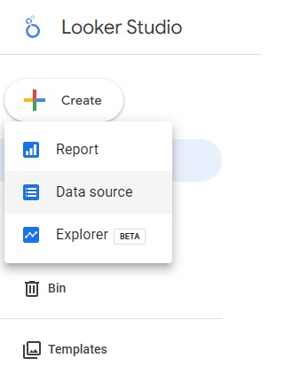

Select BigQuery (it may be necessary to authorize Google Data Studio to access BigQuery)

Then select fact_trips from your project

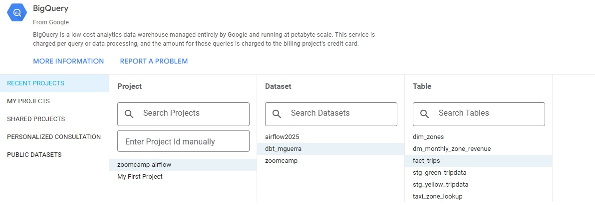

Click on Connect

### Set Default aggregations

In the next screen, we can see that the tool already suggests some aggregations for us. In this example, we set all of them to None, except for passenger_count, for which we keep the "Sum" aggregation.

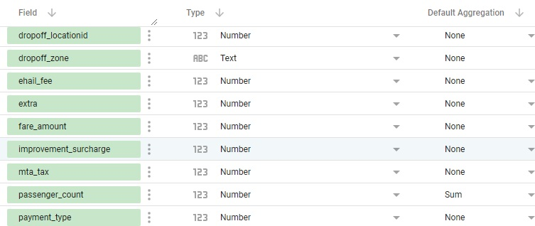

Then click on CREATE REPORT --> Add report

### Add a date range control

First, eliminate the default chart. Then click on Add a control --> Date range control

- Select start date Jan 1, 2019
- Select end date Dec 31, 2020

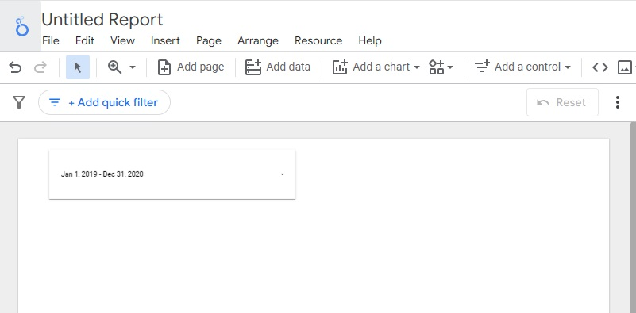

### Add a time series chart

Select Add a chart --> Time series chart

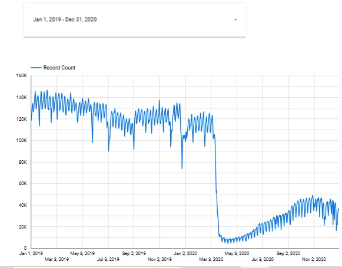

Let's add a breakdown dimension

On the rigth menu, click on add dimension --> drag and drop service_type

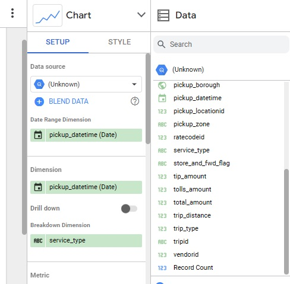

The chart now should look like this:

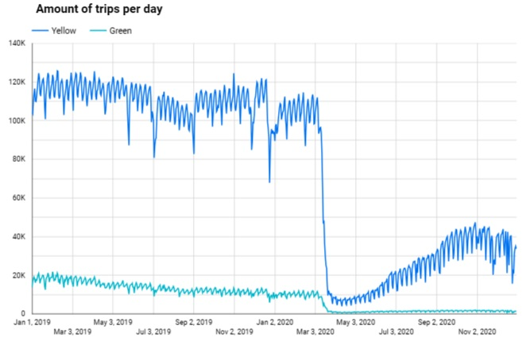

If you look at the graph, the drop that you can see in march because of covid.

### Add a scorecard

Select Add a chart --> Scorecard with compact numbers

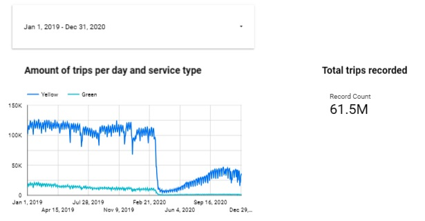

### Add a pie chart

Select Add a chart --> pie chart

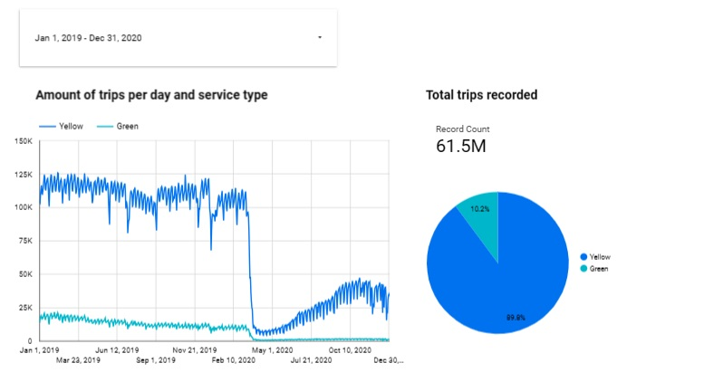

### Add a table with heatmap

Select Add a chart --> table with heatmap

Select pickup_zone as dimension

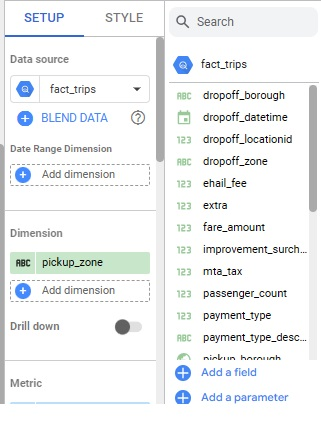

The table should look like this:

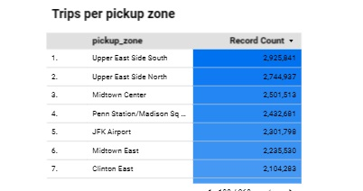

### Add a stacked column chart

Select Add a chart --> stacked column chart

We will also add a Stacked Column Bar showing trips per month. Since we do not have that particular dimension, what we can do instead is to create a new field that will allow us to filter by month:

1. In the Available Fields sidebar, click on Add a field at the bottom --> Add calculated field
2. Name the new field pickup_month.
3. In the Formula field, type MONTH(pickup_datetime).
4. Click on Save and then on Done.
5. Back in the main page, drag the new pickup_month field  to the Dimension field.
6. Get rid of all breakdown dimensions.

Our bar chart will now display trips per month but we still want to discriminate by year:

1. Add a new field and name it pickup_year.
2. Type in the formula YEAR(pickup_datetime).
3. Click on Save and Done.
4. Add the pickup_year field as a breakdown dimension for the bar chart.
5. Change the Sort dimension to pickup_month and make it ascending.

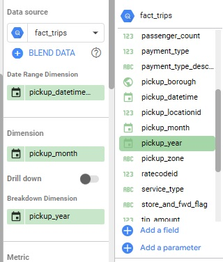

The table should look like this:

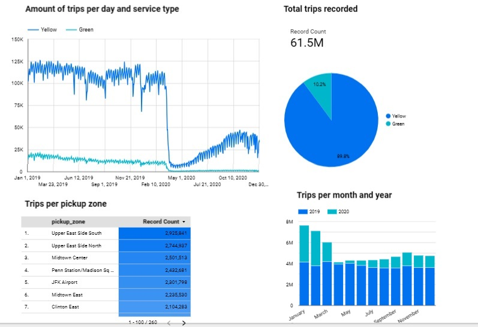

## Viz with Metabase

Metabase has two versions:

- [Metabase download](https://www.metabase.com/start/oss/)
- [Metabase Cloud](https://www.metabase.com/start/cloud/)

We will use the download version.

### Metabase Open Source

```bash
docker run -d -p 3000:3000 --name metabase metabase/metabase
```

The idea of this is to connect to PostgreSQL Database, so the docker in which we are running the database should be running and port 3000 should be open.
